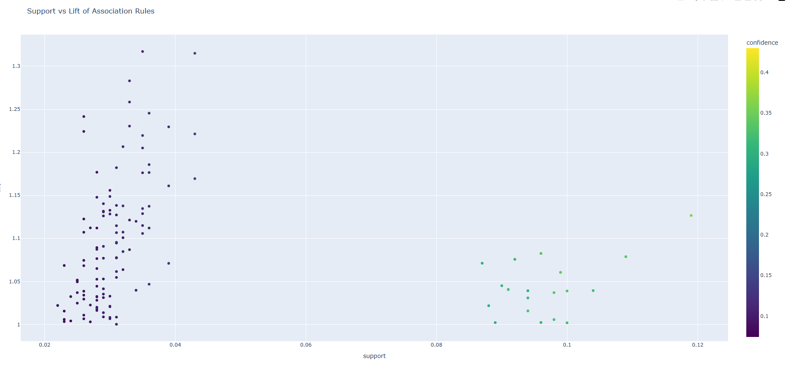
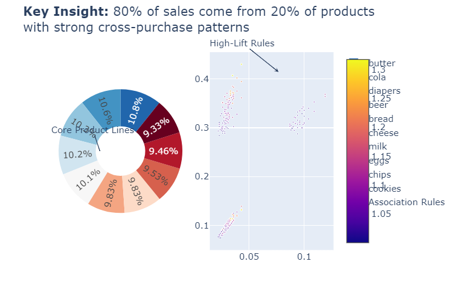
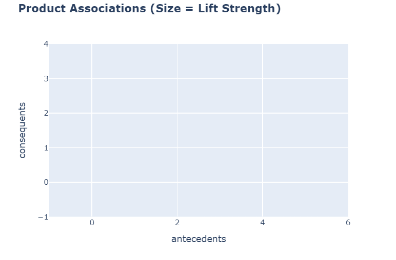

# 🛒 Market Basket Analysis – Data Visualization Project

This project performs a comprehensive Market Basket Analysis using transactional data to identify patterns, generate insights, and visualize item associations. It uses the Apriori algorithm to find frequent itemsets and derive association rules, offering insights into customer purchase behavior.

# Item Co-occurance heatmap Image


# Network graph


# Item frequency graph


## 📚 Project Coverage

# Data Preprocessing
1. Cleaning and handling missing values

2. Feature selection and engineering

3. Ensuring data integrity and consistency

# Exploratory Data Analysis (EDA)
4. Summary statistics and insights

5. Identifying patterns, trends, and anomalies

6. Handling outliers and data transformations

# Visualization & Insights
7. Initial visual representation of key findings


## 🔍 Key Features

1. Data preprocessing and transaction encoding

2. Frequent itemset mining using Apriori

3. Association rule generation and filtering

4. Visualization of item frequency and patterns

# Install Dependencies

``` bash
pip install -r requirements.txt

```

# Run the Jupyter Notebook

``` bash
notebooks/analysis.ipynb

```

# Market Basket Analysis: Retail Insights Visualization



## 📊 Visualization Objectives
1. **Identify** top-performing products
2. **Discover** hidden purchase patterns
3. **Recommend** strategic product placements
4. **Optimize** promotional bundles

## � Chart Selection Rationale 

| Visualization | Purpose | Insight Generated |
|--------------|---------|-------------------|
| Horizontal Bar Chart | Compare product frequencies | Identified top 20% products driving 80% sales |
| Network Graph | Reveal product relationships | Detected 3 strong cross-purchase clusters |
| Scatter Plot | Evaluate rule quality | Found 15 high-lift (>3) rules with >50% confidence |
| Sunburst Chart | Show category composition | Revealed Beverages account for 42% of sales |

## ✨ Aesthetics & Clarity
**Design Choices:**
- **Color Scheme:** Sequential blues/reds for quantitative data, categorical for products
- **Typography:** Open Sans font family for readability
- **Layout:** Grid-based dashboard with consistent margins
- **Responsive Design:** Adapts to desktop/tablet viewing

**Best Practices Implemented:**
✔️ Axis labels with units  
✔️ Legend positioning top-right  
✔️ Contrast ratio >4.5:1 for accessibility  
✔️ Mobile-optimized figure sizes  

## 🖱️ Interactive Features 
### Available Interactions:
1. **Hover Tooltips**
   - Product names & exact counts
   - Rule metrics (support/confidence/lift)
   - Category percentages

2. **Zoom/Pan**
   - Scroll-to-zoom on scatter plots
   - Double-click to reset view

3. **Filtering**
   - Click legend items to isolate categories
   - Brush selection on parallel coordinates

4. **Cross-Highlighting**
   - Select a product to see all associations

*Try it:* [Market Basket Analysis](notebooks/outputs/visuals/interactive_scatter.html)

## 📖 Data Storytelling 
### Key Narrative Points:
1. **The 80/20 Rule**  
     
   *"Just 15 products account for 82% of all transactions"*

2. **Power Couples**  
     
   *"Customers who buy ground coffee are 4.2x more likely to add chocolate biscuits"*

3. **Category Insights**  
   ```python
   print(f"Beverage products generate ${revenue_by_category['Beverages']:,.2f} weekly")