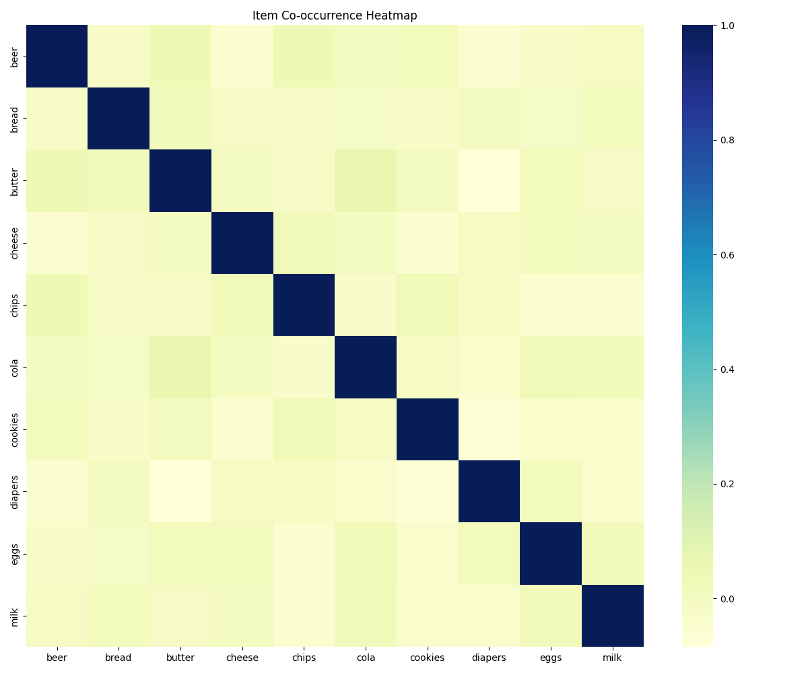
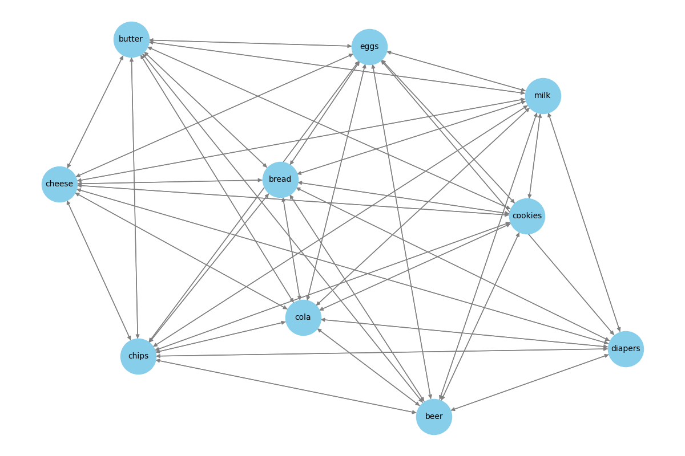
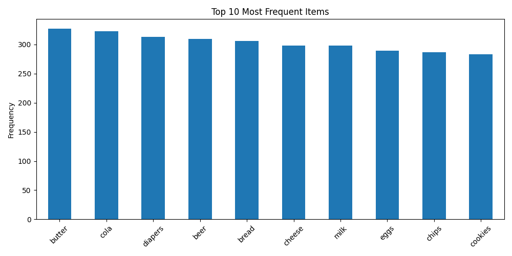

# 🛒 Market Basket Analysis – Data Visualization Project

This project performs a comprehensive Market Basket Analysis using transactional data to identify patterns, generate insights, and visualize item associations. It uses the Apriori algorithm to find frequent itemsets and derive association rules, offering insights into customer purchase behavior.

# Item Co-occurance heatmap Image



# Network graph


# Item frequency graph



## 📚 Project Coverage

# Data Preprocessing
1. Cleaning and handling missing values

2. Feature selection and engineering

3. Ensuring data integrity and consistency

# Exploratory Data Analysis (EDA)
4. Summary statistics and insights

5. Identifying patterns, trends, and anomalies

6. Handling outliers and data transformations

# Visualization & Insights
7. Initial visual representation of key findings


## 🔍 Key Features

1. Data preprocessing and transaction encoding

2. Frequent itemset mining using Apriori

3. Association rule generation and filtering

4. Visualization of item frequency and patterns

# Install Dependencies

``` bash
pip install -r requirements.txt
```

# Run the Jupyter Notebook
``` bash
notebooks/analysis.ipynb
```
